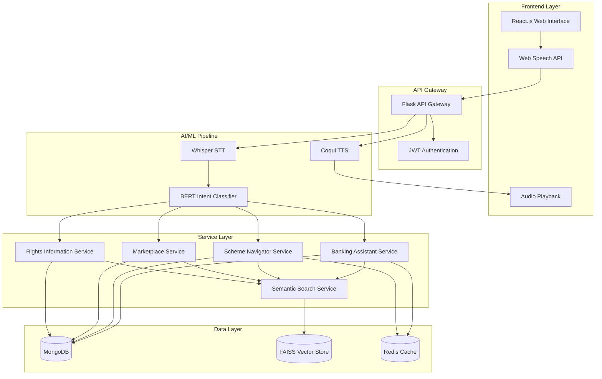
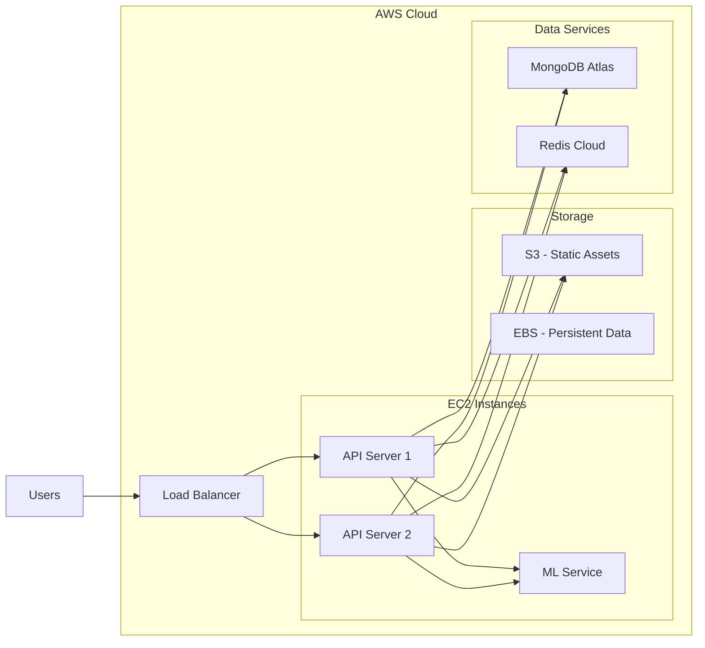

# Design Document: Voice Assistant Platform

## Overview

The Voice Assistant Platform is a voice-first application designed to bridge the digital divide for farmers, workers, and small business owners in India. The platform provides accessible banking assistance, government scheme navigation, job marketplace services, and rights information through natural voice interactions in local languages.

The system architecture follows a microservices-inspired approach with clear separation between the frontend voice interface, backend API services, AI/ML processing pipeline, and data storage layers. The design prioritizes low latency, multilingual support, and accessibility for users with limited digital literacy.

### Key Design Goals

1. **Voice-First Experience**: All features accessible through natural voice commands
2. **Low Latency**: Sub-3-second response times for voice interactions
3. **Multilingual Support**: Seamless operation in 5+ local languages
4. **Offline Resilience**: Graceful degradation with poor connectivity
5. **Scalability**: Support for growing user base and content
6. **Security**: Protection of sensitive user data and voice inputs

## Architecture

### High-Level Architecture



### Architecture Layers

**Frontend Layer**
- React.js single-page application with responsive design
- Web Speech API integration for browser-based voice input
- Audio playback for TTS responses
- Tailwind CSS for accessible, mobile-first UI

**API Gateway**
- Flask-based REST API serving all client requests
- JWT-based authentication and session management
- Request routing to appropriate service handlers
- Rate limiting and request validation

**AI/ML Pipeline**
- Whisper model for speech-to-text conversion (multilingual)
- BERT-based intent classification for routing user queries
- Coqui TTS for natural-sounding voice responses
- Language detection and translation services

**Service Layer**
- Banking Assistant: Financial literacy and banking guidance
- Scheme Navigator: Government scheme discovery and tracking
- Marketplace: Job matching and service listings
- Rights Information: Legal rights and protections
- Semantic Search: Vector-based content retrieval

**Data Layer**
- MongoDB: User profiles, schemes, jobs, marketplace listings
- FAISS: Vector embeddings for semantic search
- Redis: Session data, frequently accessed content cache

### Deployment Architecture



**Deployment Strategy**
- Docker containers for consistent deployment
- Horizontal scaling for API servers behind load balancer
- Dedicated ML service instance for AI/ML workloads
- Managed MongoDB Atlas for database
- Redis Cloud for distributed caching
- S3 for static assets and audio file storage
- CloudWatch for monitoring and logging

## Components and Interfaces

### 1. Authentication Service

**Responsibility**: Manage user registration, login, and session management

**Interface**:
```python
class AuthenticationService:
    def register_user(voice_input: VoiceInput) -> RegistrationResult:
        """
        Register a new user via voice input
        Returns: RegistrationResult with user_id and session_token
        """
        pass
    
    def login(credentials: Credentials) -> SessionToken:
        """
        Authenticate user and create session
        Returns: JWT session token
        """
        pass
    
    def verify_token(token: str) -> UserContext:
        """
        Verify JWT token and extract user context
        Returns: UserContext with user_id, language, location
        """
        pass
    
    def logout(token: str) -> bool:
        """
        Invalidate session token
        Returns: Success status
        """
        pass
```

**Key Operations**:
- Voice-guided registration flow
- PIN or password-based authentication
- JWT token generation with 24-hour expiration
- Account lockout after 3 failed attempts
- Session management with Redis

### 2. Speech Recognition Engine

**Responsibility**: Convert voice input to text in multiple languages

**Interface**:
```python
class SpeechRecognitionEngine:
    def transcribe(audio: AudioData, language: str) -> TranscriptionResult:
        """
        Convert audio to text using Whisper model
        Returns: TranscriptionResult with text and confidence score
        """
        pass
    
    def detect_language(audio: AudioData) -> str:
        """
        Detect spoken language from audio
        Returns: Language code (e.g., 'hi', 'ta', 'te')
        """
        pass
    
    def validate_audio_quality(audio: AudioData) -> QualityMetrics:
        """
        Check audio quality before processing
        Returns: QualityMetrics with SNR and clarity score
        """
        pass
```

**Implementation Details**:
- OpenAI Whisper model (medium or large variant)
- Support for Hindi, Tamil, Telugu, Bengali, Marathi
- Confidence threshold: 0.85 for acceptance
- Audio preprocessing: noise reduction, normalization
- Fallback to re-recording if quality is poor

### 3. Intent Classifier

**Responsibility**: Determine user intent and route to appropriate service

**Interface**:
```python
class IntentClassifier:
    def classify(text: str, context: ConversationContext) -> Intent:
        """
        Classify user intent from text
        Returns: Intent with service route and parameters
        """
        pass
    
    def extract_entities(text: str) -> Dict[str, Any]:
        """
        Extract named entities and parameters
        Returns: Dictionary of entity types and values
        """
        pass
```

**Intent Categories**:
- `BANKING_QUERY`: Banking assistance requests
- `SCHEME_SEARCH`: Government scheme inquiries
- `JOB_SEARCH`: Job or service marketplace queries
- `RIGHTS_INFO`: Legal rights information
- `NAVIGATION`: Platform navigation commands
- `HELP`: Help and guidance requests

**Implementation**:
- Fine-tuned BERT model for intent classification
- Multi-label classification for complex queries
- Entity extraction for parameters (location, amount, date)
- Context-aware classification using conversation history

### 4. Text-to-Speech Engine

**Responsibility**: Convert text responses to natural voice output

**Interface**:
```python
class TextToSpeechEngine:
    def synthesize(text: str, language: str, voice_profile: str) -> AudioData:
        """
        Convert text to speech audio
        Returns: AudioData in compressed format
        """
        pass
    
    def get_available_voices(language: str) -> List[VoiceProfile]:
        """
        List available voice profiles for language
        Returns: List of voice profiles with gender and style
        """
        pass
```

**Implementation Details**:
- Coqui TTS for natural-sounding synthesis
- Gender-neutral voice profiles for each language
- Audio compression (MP3, 64kbps) for bandwidth efficiency
- Prosody adjustment for natural intonation
- SSML support for emphasis and pauses

### 5. Banking Assistant Service

**Responsibility**: Provide banking education and guidance

**Interface**:
```python
class BankingAssistantService:
    def explain_term(term: str, language: str) -> Explanation:
        """
        Explain banking term in simple language
        Returns: Explanation with definition and examples
        """
        pass
    
    def guide_account_opening(user_profile: UserProfile) -> AccountGuidance:
        """
        Provide step-by-step account opening guidance
        Returns: AccountGuidance with required documents and steps
        """
        pass
    
    def detect_fraud(transaction_description: str) -> FraudAssessment:
        """
        Assess potential fraud from user description
        Returns: FraudAssessment with risk level and advice
        """
        pass
    
    def explain_operation(operation: str, language: str) -> OperationGuide:
        """
        Explain banking operation (deposit, transfer, loan)
        Returns: OperationGuide with steps and tips
        """
        pass
```

**Content Database**:
- Banking terms glossary (500+ terms)
- Account opening procedures by bank type
- Fraud detection patterns and warnings
- Common banking operations guides
- Fee structures and cost-saving tips

### 6. Scheme Navigator Service

**Responsibility**: Help users discover and apply for government schemes

**Interface**:
```python
class SchemeNavigatorService:
    def search_schemes(user_profile: UserProfile, query: str) -> List[Scheme]:
        """
        Find relevant schemes for user
        Returns: List of schemes ranked by relevance
        """
        pass
    
    def check_eligibility(scheme_id: str, user_profile: UserProfile) -> EligibilityResult:
        """
        Check if user is eligible for scheme
        Returns: EligibilityResult with yes/no and reasons
        """
        pass
    
    def explain_documents(scheme_id: str, language: str) -> DocumentGuide:
        """
        Explain required documents in simple terms
        Returns: DocumentGuide with document list and explanations
        """
        pass
    
    def track_application(application_id: str) -> ApplicationStatus:
        """
        Get current status of scheme application
        Returns: ApplicationStatus with stage and next steps
        """
        pass
```

**Scheme Data Model**:
```python
class Scheme:
    scheme_id: str
    name: Dict[str, str]  # Multilingual names
    description: Dict[str, str]  # Multilingual descriptions
    eligibility_criteria: List[Criterion]
    required_documents: List[Document]
    benefits: str
    application_process: List[Step]
    state: Optional[str]  # None for central schemes
    category: str  # farmer, worker, business, general
    last_updated: datetime
```

### 7. Marketplace Service

**Responsibility**: Connect service providers, job seekers, and customers

**Interface**:
```python
class MarketplaceService:
    def create_listing(listing_data: VoiceListingInput) -> Listing:
        """
        Create service or product listing from voice input
        Returns: Listing with generated ID
        """
        pass
    
    def search_services(query: str, location: Location, radius_km: int) -> List[Listing]:
        """
        Search for services near user location
        Returns: List of listings ranked by relevance and proximity
        """
        pass
    
    def match_jobs(skills: List[str], location: Location) -> List[JobMatch]:
        """
        Match user skills with job opportunities
        Returns: List of job matches with compatibility scores
        """
        pass
    
    def notify_match(listing_id: str, user_id: str) -> bool:
        """
        Notify both parties of a match
        Returns: Success status
        """
        pass
```

**Listing Data Model**:
```python
class Listing:
    listing_id: str
    type: str  # 'service', 'product', 'job'
    title: Dict[str, str]  # Multilingual
    description: Dict[str, str]  # Multilingual
    provider_id: str
    location: GeoLocation
    price: Optional[float]
    skills_required: List[str]  # For jobs
    category: str
    created_at: datetime
    status: str  # 'active', 'filled', 'expired'
```

### 8. Rights Information Service

**Responsibility**: Provide legal rights information in accessible language

**Interface**:
```python
class RightsInformationService:
    def get_rights(user_role: str, query: str, state: str) -> RightsInfo:
        """
        Get relevant rights information for user role
        Returns: RightsInfo with applicable rights and protections
        """
        pass
    
    def explain_situation(situation_description: str, user_role: str) -> SituationAnalysis:
        """
        Analyze situation and identify applicable rights
        Returns: SituationAnalysis with rights and recommended actions
        """
        pass
    
    def get_minimum_wage(state: str, sector: str) -> WageInfo:
        """
        Get minimum wage information for state and sector
        Returns: WageInfo with current rates and regulations
        """
        pass
```

**Rights Content Structure**:
- Worker rights: minimum wage, working hours, safety, termination
- Farmer rights: land ownership, MSP, crop insurance, water rights
- Business rights: licensing, taxation, labor laws, contracts
- State-specific variations and local regulations
- Contact information for legal aid and helplines

### 9. Semantic Search Service

**Responsibility**: Perform vector-based semantic search across content

**Interface**:
```python
class SemanticSearchService:
    def search(query: str, language: str, content_type: str) -> List[SearchResult]:
        """
        Perform semantic search across content
        Returns: List of results ranked by semantic similarity
        """
        pass
    
    def index_content(content: Content, embeddings: np.ndarray) -> bool:
        """
        Index new content with vector embeddings
        Returns: Success status
        """
        pass
    
    def update_embeddings(content_id: str, new_embeddings: np.ndarray) -> bool:
        """
        Update embeddings for existing content
        Returns: Success status
        """
        pass
```

**Implementation**:
- FAISS index for fast similarity search
- Sentence-BERT for multilingual embeddings
- Separate indices for schemes, banking content, rights info
- Approximate nearest neighbor search (HNSW algorithm)
- Re-ranking based on user context and location

### 10. Conversation Manager

**Responsibility**: Maintain conversation context and handle multi-turn dialogues

**Interface**:
```python
class ConversationManager:
    def start_conversation(user_id: str) -> ConversationSession:
        """
        Initialize new conversation session
        Returns: ConversationSession with session_id
        """
        pass
    
    def add_turn(session_id: str, user_input: str, system_response: str) -> bool:
        """
        Add conversation turn to history
        Returns: Success status
        """
        pass
    
    def get_context(session_id: str) -> ConversationContext:
        """
        Retrieve conversation context for intent classification
        Returns: ConversationContext with history and entities
        """
        pass
    
    def end_conversation(session_id: str) -> bool:
        """
        Close conversation and cleanup session data
        Returns: Success status
        """
        pass
```

**Context Management**:
- Store last 5 conversation turns in Redis
- Track extracted entities across turns
- Maintain current service context (banking, schemes, etc.)
- Session timeout after 10 minutes of inactivity
- Context-aware intent classification

## Data Models

### User Profile

```python
class UserProfile:
    user_id: str
    phone_number: str  # Primary identifier
    name: str
    role: str  # 'farmer', 'worker', 'business_owner', 'service_provider'
    preferred_language: str
    location: Location
    registration_date: datetime
    last_login: datetime
    preferences: Dict[str, Any]
```

### Location

```python
class Location:
    state: str
    district: str
    pincode: Optional[str]
    coordinates: Optional[GeoCoordinates]
```

### GeoCoordinates

```python
class GeoCoordinates:
    latitude: float
    longitude: float
```

### VoiceInput

```python
class VoiceInput:
    audio_data: bytes
    format: str  # 'wav', 'mp3', 'webm'
    sample_rate: int
    duration_seconds: float
    language: Optional[str]
```

### TranscriptionResult

```python
class TranscriptionResult:
    text: str
    confidence: float
    language: str
    processing_time_ms: int
```

### Intent

```python
class Intent:
    intent_type: str
    confidence: float
    service: str  # Target service
    entities: Dict[str, Any]
    requires_clarification: bool
```

### ConversationContext

```python
class ConversationContext:
    session_id: str
    user_id: str
    history: List[ConversationTurn]
    current_service: Optional[str]
    extracted_entities: Dict[str, Any]
    language: str
```

### ConversationTurn

```python
class ConversationTurn:
    timestamp: datetime
    user_input: str
    system_response: str
    intent: Intent
```

### SearchResult

```python
class SearchResult:
    content_id: str
    content_type: str
    title: str
    snippet: str
    relevance_score: float
    metadata: Dict[str, Any]
```

## Correctness Properties

*A property is a characteristic or behavior that should hold true across all valid executions of a system—essentially, a formal statement about what the system should do. Properties serve as the bridge between human-readable specifications and machine-verifiable correctness guarantees.*


### Property Reflection

After analyzing all acceptance criteria, several properties can be consolidated:

**Authentication & Session Management**:
- Properties 1.2, 1.3, 1.4 all relate to user data persistence and validation - can be combined into comprehensive user management properties
- Property 1.5 (JWT expiration) is a specific case of session management

**Content Retrieval & Filtering**:
- Properties 4.1, 4.5, 8.2, 8.3 all involve location-based filtering - can be unified
- Properties 7.1, 7.2, 7.3 all relate to semantic search quality - can be combined
- Properties 9.1, 9.2, 9.4 all relate to multilingual content delivery - can be unified

**Data Persistence**:
- Properties 1.4, 5.1, 5.4, 8.1 all involve storing data with required fields - can use a general property about data completeness

**Marketplace Operations**:
- Properties 5.3 and 5.6 both involve filtering and ranking - can be combined

**Error Handling**:
- Properties 2.5, 10.5, 12.2 all involve error responses - can be unified into general error handling property

After reflection, we'll focus on unique, high-value properties that provide distinct validation coverage.

### Core Properties

**Property 1: User Registration Data Completeness**
*For any* user registration with valid input data, the created user profile should contain all required fields (user_id, phone_number, name, role, preferred_language, location, registration_date)
**Validates: Requirements 1.2, 1.4, 8.1**

**Property 2: Authentication Success and Failure**
*For any* valid credentials, authentication should succeed and return a valid session token; for any invalid credentials, authentication should fail with an appropriate error
**Validates: Requirements 1.3**

**Property 3: Session Token Expiration**
*For any* session token, after the expiration time has passed, the token should be rejected by the verification service
**Validates: Requirements 1.5**

**Property 4: Speech-to-Text Round Trip Quality**
*For any* audio input with quality score above threshold (0.85), the speech recognition engine should produce a transcription result with confidence above the threshold
**Validates: Requirements 2.1**

**Property 5: Intent Classification Completeness**
*For any* text input, the intent classifier should return a valid intent with a recognized service route (banking, schemes, marketplace, rights, navigation, help)
**Validates: Requirements 2.2**

**Property 6: Text-to-Speech Output Generation**
*For any* text response and supported language, the TTS engine should produce audio output in the specified language
**Validates: Requirements 2.3**

**Property 7: Poor Audio Quality Handling**
*For any* audio input with quality score below threshold, the system should request the user to repeat their input rather than attempting transcription
**Validates: Requirements 2.5**

**Property 8: Banking Content Retrieval**
*For any* banking term query, the banking assistant should return an explanation containing the term definition
**Validates: Requirements 3.1**

**Property 9: Fraud Detection Response**
*For any* transaction description input, the banking assistant should return a fraud assessment with risk level and guidance
**Validates: Requirements 3.3**

**Property 10: Scheme Location Filtering**
*For any* user location (state), the returned schemes should include only central schemes and schemes specific to that state
**Validates: Requirements 4.1, 4.5**

**Property 11: Eligibility Determination**
*For any* user profile and scheme, the eligibility check should return a boolean result (eligible or not eligible) with reasoning
**Validates: Requirements 4.2**

**Property 12: Scheme Document Information**
*For any* valid scheme, the system should return a list of required documents with explanations
**Validates: Requirements 4.3**

**Property 13: Application Status Tracking**
*For any* created application, the system should maintain and return current status information
**Validates: Requirements 4.4**

**Property 14: Marketplace Listing Creation**
*For any* service description input, the created listing should contain all provided details (title, description, location, price if applicable)
**Validates: Requirements 5.1, 5.4**

**Property 15: Job Matching**
*For any* set of user skills, the marketplace should return job opportunities that require at least one of those skills
**Validates: Requirements 5.2**

**Property 16: Marketplace Spatial Filtering**
*For any* marketplace search with location and radius, all returned results should be within the specified radius of the user's location
**Validates: Requirements 5.6, 8.5**

**Property 17: Marketplace Result Ranking**
*For any* marketplace search with multiple results, results should be ordered by relevance score (descending) and then by proximity (ascending)
**Validates: Requirements 5.3**

**Property 18: Match Notification**
*For any* successful job or service match, both the provider and seeker should receive notification
**Validates: Requirements 5.5**

**Property 19: Rights Information Role Filtering**
*For any* user role (farmer, worker, business_owner) and rights query, the returned information should be tagged as relevant to that role
**Validates: Requirements 6.1**

**Property 20: Rights Situation Analysis**
*For any* situation description, the rights information system should identify at least one applicable right or protection
**Validates: Requirements 6.3**

**Property 21: Location-Specific Rights**
*For any* location-specific rights query, the returned information should match the user's state
**Validates: Requirements 6.5**

**Property 22: Semantic Search Relevance**
*For any* query, the semantic search should return results ordered by semantic similarity score (descending)
**Validates: Requirements 7.1, 7.3**

**Property 23: Synonym Query Consistency**
*For any* two queries that are synonymous (same semantic meaning), the top search results should have significant overlap
**Validates: Requirements 7.2**

**Property 24: Conversation Context Maintenance**
*For any* follow-up question in a conversation, the system should have access to entities and intents from previous turns
**Validates: Requirements 7.4**

**Property 25: Empty Search Results Handling**
*For any* query that returns no results, the system should provide alternative suggestions or related queries
**Validates: Requirements 7.5**

**Property 26: Location-Based Content Prioritization**
*For any* location-specific content query, results matching the user's location should be ranked higher than non-matching results
**Validates: Requirements 8.2, 8.3**

**Property 27: Location Update**
*For any* location update command, the user's stored location should reflect the new location value
**Validates: Requirements 8.4**

**Property 28: Multilingual Content Availability**
*For any* content item, it should have versions in at least the default language (Hindi or English)
**Validates: Requirements 9.1**

**Property 29: Language-Specific Content Delivery**
*For any* user language preference, all returned content should be in that language or include a fallback notification
**Validates: Requirements 9.2, 9.4**

**Property 30: Dynamic Language Switching**
*For any* language switch command during a session, subsequent responses should be in the newly selected language
**Validates: Requirements 9.3**

**Property 31: Cache Staleness Prevention**
*For any* cached content older than the configured TTL (6 hours), the system should fetch fresh content rather than serving stale cache
**Validates: Requirements 10.3**

**Property 32: Audio Compression**
*For any* audio response generated by TTS, the output should be in compressed format (MP3 or similar) with size smaller than uncompressed WAV
**Validates: Requirements 10.4**

**Property 33: Network Error Handling**
*For any* network error condition, the system should return an error response with an informative message
**Validates: Requirements 10.5**

**Property 34: Data Encryption**
*For any* user data stored in the database, the sensitive fields should be encrypted
**Validates: Requirements 11.1**

**Property 35: Voice Recording Cleanup**
*For any* ended conversation session, associated voice recordings should be deleted from storage
**Validates: Requirements 11.2**

**Property 36: User Data Deletion**
*For any* user data deletion request, all personal information associated with that user should be removed from the system
**Validates: Requirements 11.3**

**Property 37: Password Complexity Enforcement**
*For any* password or PIN input during registration, it should meet the defined complexity requirements (minimum length, character types)
**Validates: Requirements 11.4**

**Property 38: Sensitive Data Access Logging**
*For any* access to sensitive user data, an audit log entry should be created with timestamp, user_id, and action
**Validates: Requirements 11.5**

**Property 39: Account Lockout After Failed Attempts**
*For any* sequence of 3 consecutive failed login attempts for an account, the account should be temporarily locked
**Validates: Requirements 11.6**

**Property 40: Voice Feedback for Actions**
*For any* user action, the system should generate a voice response confirming or acknowledging the action
**Validates: Requirements 12.1**

**Property 41: Error Correction Guidance**
*For any* error condition (invalid input, failed operation), the system response should include guidance on how to correct the error
**Validates: Requirements 12.2**

**Property 42: Navigation Command Handling**
*For any* navigation command (back, repeat, help, exit), the system should perform the corresponding navigation action
**Validates: Requirements 12.3**

**Property 43: Critical Action Confirmation**
*For any* critical action (application submission, payment, data deletion), the system should request explicit user confirmation before execution
**Validates: Requirements 12.4**

**Property 44: Inactivity Prompting**
*For any* conversation session with no user input for the timeout period (30 seconds), the system should send a prompt with suggestions
**Validates: Requirements 12.5**

## Error Handling

### Error Categories

**1. Input Validation Errors**
- Invalid audio format or corrupted audio data
- Audio quality below acceptable threshold
- Missing required fields in user input
- Invalid data types or out-of-range values

**Error Response**:
```python
{
    "error_type": "VALIDATION_ERROR",
    "message": "User-friendly error message in selected language",
    "corrective_action": "Specific guidance on how to fix the issue",
    "retry_allowed": true
}
```

**2. Authentication and Authorization Errors**
- Invalid credentials
- Expired session token
- Insufficient permissions
- Account locked due to failed attempts

**Error Response**:
```python
{
    "error_type": "AUTH_ERROR",
    "message": "Authentication failed",
    "reason": "Invalid credentials" | "Token expired" | "Account locked",
    "retry_allowed": false,  # For locked accounts
    "lockout_duration_seconds": 900  # If applicable
}
```

**3. Service Unavailability Errors**
- ML service timeout
- Database connection failure
- External API unavailable
- Rate limit exceeded

**Error Response**:
```python
{
    "error_type": "SERVICE_ERROR",
    "message": "Service temporarily unavailable",
    "retry_after_seconds": 60,
    "fallback_available": true
}
```

**4. Content Not Found Errors**
- No search results
- Scheme not found
- User profile not found
- Listing expired or deleted

**Error Response**:
```python
{
    "error_type": "NOT_FOUND",
    "message": "Content not found",
    "suggestions": ["Alternative queries or actions"],
    "help_available": true
}
```

**5. Business Logic Errors**
- User not eligible for scheme
- Listing already filled
- Invalid state transition
- Duplicate registration

**Error Response**:
```python
{
    "error_type": "BUSINESS_ERROR",
    "message": "Operation not allowed",
    "reason": "Specific business rule violation",
    "alternative_actions": ["Suggested alternatives"]
}
```

### Error Handling Strategies

**Graceful Degradation**:
- If ML service is unavailable, fall back to keyword-based search
- If TTS fails, return text response with apology
- If location service fails, use last known location
- If preferred language content unavailable, use fallback language

**Retry Logic**:
- Automatic retry for transient network errors (max 3 attempts)
- Exponential backoff for service timeouts
- User-initiated retry for validation errors
- No retry for authentication failures (security)

**User Communication**:
- All errors explained in user's selected language
- Simple, non-technical language
- Clear corrective actions provided
- Help command always available

**Logging and Monitoring**:
- All errors logged with context (user_id, session_id, timestamp)
- Critical errors trigger alerts
- Error rate monitoring per service
- User-facing error messages sanitized (no sensitive data)

## Testing Strategy

### Dual Testing Approach

The platform will employ both unit testing and property-based testing to ensure comprehensive coverage:

**Unit Tests**: Verify specific examples, edge cases, and error conditions
- Specific user registration scenarios
- Known fraud patterns in banking assistant
- Specific scheme eligibility calculations
- Edge cases like empty inputs, boundary values
- Integration points between components

**Property Tests**: Verify universal properties across all inputs
- All 44 correctness properties defined above
- Each property test will run minimum 100 iterations
- Random generation of user profiles, queries, locations, etc.
- Comprehensive input coverage through randomization

### Property-Based Testing Configuration

**Testing Library**: 
- Python: `hypothesis` library for property-based testing
- JavaScript/TypeScript: `fast-check` library for frontend tests

**Test Configuration**:
- Minimum 100 iterations per property test
- Seed-based reproducibility for failed tests
- Shrinking enabled to find minimal failing examples
- Timeout: 30 seconds per property test

**Test Tagging**:
Each property test must include a comment tag referencing the design property:
```python
# Feature: voice-assistant-platform, Property 10: Scheme Location Filtering
@given(user_location=locations(), schemes=scheme_lists())
def test_scheme_location_filtering(user_location, schemes):
    # Test implementation
    pass
```

### Test Data Generators

**User Profile Generator**:
```python
@composite
def user_profiles(draw):
    return UserProfile(
        user_id=draw(uuids()),
        phone_number=draw(phone_numbers()),
        name=draw(text(min_size=1, max_size=50)),
        role=draw(sampled_from(['farmer', 'worker', 'business_owner', 'service_provider'])),
        preferred_language=draw(sampled_from(['hi', 'ta', 'te', 'bn', 'mr'])),
        location=draw(locations())
    )
```

**Location Generator**:
```python
@composite
def locations(draw):
    return Location(
        state=draw(sampled_from(INDIAN_STATES)),
        district=draw(text(min_size=1, max_size=30)),
        coordinates=draw(geo_coordinates())
    )
```

**Audio Input Generator**:
```python
@composite
def audio_inputs(draw):
    return VoiceInput(
        audio_data=draw(binary(min_size=1000, max_size=100000)),
        format=draw(sampled_from(['wav', 'mp3', 'webm'])),
        sample_rate=draw(sampled_from([16000, 44100, 48000])),
        duration_seconds=draw(floats(min_value=0.5, max_value=30.0))
    )
```

### Integration Testing

**End-to-End Flows**:
1. User registration → Login → Profile retrieval
2. Voice input → STT → Intent classification → Service routing → TTS → Audio output
3. Scheme search → Eligibility check → Document explanation
4. Service listing creation → Search → Match → Notification

**Component Integration**:
- API Gateway ↔ Authentication Service
- Intent Classifier ↔ Service Layer
- Service Layer ↔ Semantic Search
- Service Layer ↔ Database
- Caching layer integration

### Performance Testing

**Load Testing**:
- Concurrent user simulation (100, 500, 1000 users)
- Voice processing pipeline throughput
- Database query performance under load
- Cache hit rate measurement

**Latency Testing**:
- End-to-end response time (target: <3 seconds)
- STT processing time
- Intent classification time
- Database query time
- TTS generation time

### Security Testing

**Authentication Testing**:
- Brute force attack simulation
- Token expiration validation
- Session hijacking prevention
- Account lockout mechanism

**Data Protection Testing**:
- Encryption verification
- Data deletion completeness
- Audit log integrity
- PII handling compliance

### Accessibility Testing

**Voice Interface Testing**:
- Multi-language voice input accuracy
- TTS output quality across languages
- Error message clarity
- Navigation command responsiveness

**Low-Literacy User Testing**:
- Simple language verification
- Confirmation flow testing
- Help system effectiveness
- Error recovery paths

### Continuous Testing

**CI/CD Pipeline**:
- Unit tests run on every commit
- Property tests run on every pull request
- Integration tests run on staging deployment
- Performance tests run weekly
- Security scans run daily

**Test Coverage Goals**:
- Unit test coverage: >80% for service layer
- Property test coverage: 100% of defined properties
- Integration test coverage: All critical user flows
- API endpoint coverage: 100%
